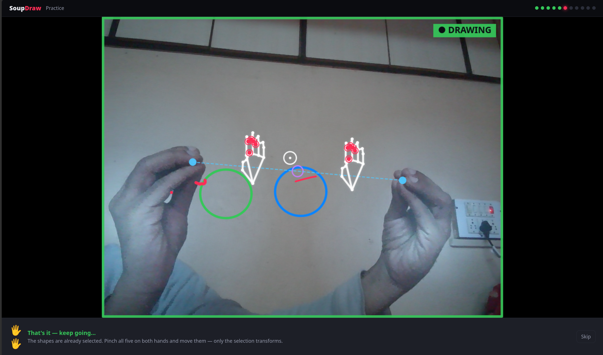
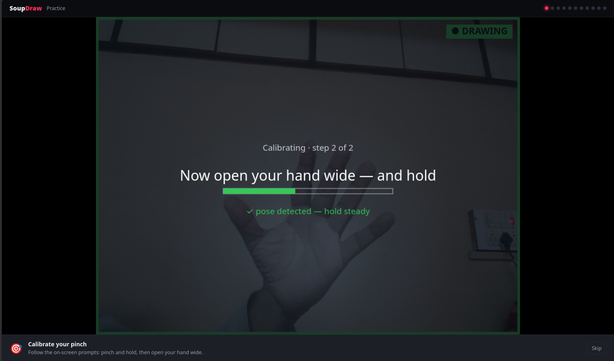
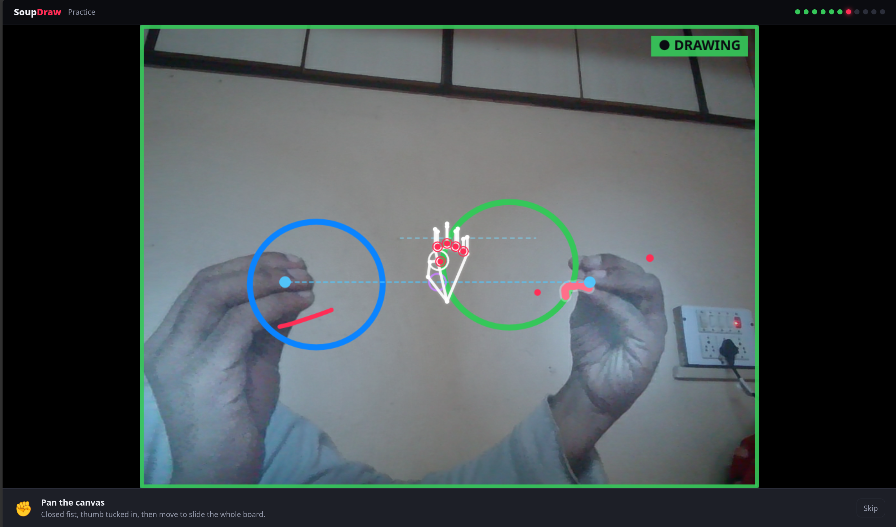

# SoupDraw: gesture camera drawing

*Draw on your live camera feed with hand gestures, on-device. A [Soup Up](https://soupup.ai) tool.*


A Firefox extension that lets you **draw on your live camera feed with hand
gestures**, so the augmented video is what other people see inside any video-call
app (Google Meet, Zoom web, Teams, Whereby). It transparently replaces the camera
any site receives with a canvas composited locally.

**Everything runs on-device. No video, no frames, no audio ever leaves your
machine.** The hand-tracking model is bundled in the extension; there are no
network calls at runtime.

<p align="center">
  
  
  <br/>
  
</p>

<p align="center"><i>The built-in Practice window: a ghost hand shows each gesture on your real feed, and you learn by doing.</i></p>

## Gestures (defaults)

| Gesture | Does |
| --- | --- |
| 🤏 Index pinch (thumb + index) | Draw |
| ✌️ Victory (index + middle, joined or spread) | Move / select shapes (cursor sits between the fingertips) |
| 👍 Fist, thumb out | Erase at the thumb tip |
| ✊ Closed fist (thumb tucked in) | Grab · pan · zoom the whole board |
| 🖐️ Five-finger pinch | Drag a board out of the history strip |
| 🖐️🖐️ Two five-finger pinches | Scale · rotate · pan (a selection, or the whole canvas) |
| ✊✊ Double fist-clench (close · open · close) | Clear the board |

Every gesture is rebindable from the popup, under **Gesture controls**. **Shape
assist** optionally snaps a rough circle / line / box / triangle to a clean shape
when it clearly fits one (freehand and squiggles are left alone), including
multi-stroke figures. New here? Open the popup and hit **Practice gestures &
calibrate** for a guided, hands-on tutorial.

## Keyboard shortcuts

| Shortcut (Win/Linux · Mac) | Does |
| --- | --- |
| `Alt+Shift+D` · `Cmd+Shift+D` | Arm / disarm drawing |
| `Alt+Shift+Z` · `Cmd+Shift+Z` | Undo |
| `Alt+Shift+Y` · `Cmd+Shift+Y` | Redo |

Customize them in `about:addons` → Manage Extension Shortcuts. (No default
shortcut for Clear, to avoid wiping the board by accident.)

## Install

**From Firefox Add-ons:** _(listing pending review)_

**Temporary, for development:**
1. Open Firefox → `about:debugging#/runtime/this-firefox`
2. Click **Load Temporary Add-on…**
3. Select `manifest.json` in this folder.

The SoupDraw icon appears in the toolbar. (Temporary add-ons unload when Firefox
restarts; reload the same way to bring it back.)

## Use it in a real call

1. Turn **Augment my camera** ON in the popup **before** joining/enabling your
   camera in the call app.
2. Join the call and pick your normal camera. The app receives the augmented
   feed; other participants see your drawings.
3. Press `Alt+Shift+D` to arm gestures; press it again before you talk.
4. Toggling on/off takes effect the next time the app requests the camera (turn
   the call's camera off and on again, or rejoin).

## How it works

```
call page ── getUserMedia ──► patched getUserMedia (MAIN world, pipeline.js)
                                   │  real camera → hidden <video>
                                   ▼
   MediaPipe Gesture Recognizer (bundled WASM), run in an EXTENSION-ORIGIN
   iframe so strict page CSPs (e.g. Meet) can't block it → hand landmarks
                                   │  gestures + drawing (engine.js, bindings.js)
                                   ▼
   compositor <canvas>: camera + your strokes (+ minimap, history, selection)
                                   │  captureStream()
                                   ▼
                 returned to the call page "as the camera"
```

- `src/page/pipeline.js`: MAIN-world script. Patches `getUserMedia`, runs the
  compositor loop, and all the action handlers.
- `src/page/engine.js`: pure gesture + drawing logic (detection, stroke model,
  smoothing, undo). No browser APIs; unit-tested in Node.
- `src/page/bindings.js`: the one catalog of gestures and their default actions.
- `src/content/recognizer.js` + `src/offscreen/recognizer.html`: the hand model
  runs here, in an extension-origin iframe under the extension's own CSP.
- `src/content/bridge.js`: isolated content script; the only code that touches
  `browser.storage`.
- `src/train/`: the interactive Practice window (hosts the real pipeline + a
  ghost-hand coaching overlay).
- `src/popup/`: the control panel.
- `vendor/tasks-vision/`: bundled MediaPipe WASM + `gesture_recognizer.task`
  (unmodified from the `@mediapipe/tasks-vision` npm package).

See `docs/superpowers/specs/2026-07-14-augmented-draw-firefox-design.md` for the
full design.

## Notes & limitations

- Toggling on/off mid-call requires the app to re-request the camera (see above).
- The MediaPipe model runs in an extension-origin iframe so strict-CSP sites can't
  block it. If augmentation ever fails, the extension safely passes your real,
  untouched camera through, so the call never breaks.
- First camera start pays a one-time model-load cost (bundled locally, no network).

## Development

```
npm test          # gesture/stroke engine + recognizer unit tests
npm run lint      # web-ext lint
npm run serve     # serve the test harness on :8123
npm run build     # produce the installable .zip in web-ext-artifacts/
```

Publishing to AMO is scripted: see `docs/SUBMISSION.md` and the `sign` /
`sign:unlisted` npm scripts.

## Privacy

No telemetry, no network, no accounts. The camera never leaves the page it was
requested on; we only re-composite it locally before handing it back. See
[PRIVACY.md](PRIVACY.md).
